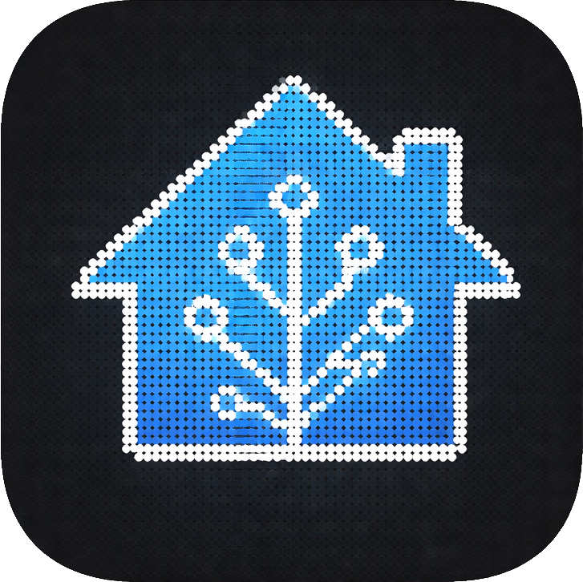

# Glyph HA Integration

  

  Android app that links Home Assistant sensors to Nothing Phone Glyph Matrix output.

## Highlights

- Connects to Home Assistant using your base URL and long-lived access token.
- Supports multiple linked sensor mappings.
- Display modes:
  - `Progress bar`: value/max bar with arrow marker.
  - `Raw number`: sensor state shown as text.
- Optional secondary text sensor for progress mode (rendered under the bar).
- Automatic slow marquee scrolling when secondary text is longer than matrix width.
- Completion behavior:
  - Selectable finish icon (`3D Printer`, `Check`, `Trophy`, `Custom`).
  - Blink animation when progress reaches 100%.
- Includes a `Debug` tab to test progress, text rendering, and completion icons manually.

## SDK Integration

- Required AAR: `app/libs/glyph-matrix-sdk-2.0.aar`
- Required permission: `com.nothing.ketchum.permission.ENABLE`

## Requirements

- Android Studio Koala or newer
- Android SDK 35
- Java 17
- Compatible Nothing phone with Glyph Matrix support

## Quick Start

1. Open the project in Android Studio.
2. Let Gradle sync and build.
3. Install on your Nothing phone.
4. Open the app and save Home Assistant URL + token.
5. Add at least one sensor mapping.
6. For progress mode, optionally set a secondary text sensor (for remaining time, status, etc.).
7. Keep the app running; sync is managed by the foreground service.

## Home Assistant Notes

- Create a long-lived token in your Home Assistant profile.
- API endpoint used: `/api/states/{entity_id}`
- Progress mode ignores non-numeric primary sensor values.

## Behavior Notes

- Rendering uses `setAppMatrixFrame(...)` for app-controlled Glyph output.
- System-level Glyph UI can override app output due to priority rules.
